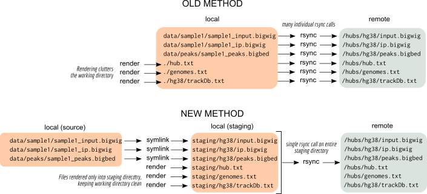

Changelog
=========

Version 0.3
-----------

Testing infrastructure overhaul
~~~~~~~~~~~~~~~~~~~~~~~~~~~~~~~

See :ref:`tests` for details.

Documentation updates
~~~~~~~~~~~~~~~~~~~~~

- Examples have been added for all of the available track types. See
  :ref:`tracktypes` for details.
- New section that details how validation works (see :ref:`validation`).

Other changes
~~~~~~~~~~~~~
- `defaultPos` can now be set when using the `default_hub` helper function

- Support for all track types supported in track hubs (see :ref:`tracktypes`)

- There is now one naming convention, `add_tracks`, rather than multiple
  methods names that perform this for different track types. `add_view` and
  `add_subtracks` can now simply be replaced with `add_tracks`. These methods
  will accept track objects, a list of track object, or a combination of the
  two. The older method names are retained for backwards compatibility, but all
  documentation has been updated to reflect this change.

- dramatically improved semi-automatic updating mechanism for making sure
  parameters are up-to-date with the main UCSC instance (see
  ``trackhub/parse.py`` and ``trackhub/parsed_params.py``).

- fixed indentation when super tracks, composite tracks, and view tracks are
  nested.

- improved handling of rsync and handling symlink modification times

Version 0.2.4 (Dec 2017)
------------------------

Improved file uploading
~~~~~~~~~~~~~~~~~~~~~~~
Instead of uploading files one-by-one, first the hub is rendered to a local
"staging" directory and tracks are symlinked over to this directory. BAM and
VCF indexes are also symlinked if needed, and any HTML documentation is also
rendered to the staging directory.  This allows for inspecting the hub locally
before uploading.  The entire directory can then be uploaded with ``rsync``
using the ``-L`` option to follow symlinks.

    Diagram illustrating the changes in uploading strategies.

    *Using the old method, the hub, genomes, and trackdb files were rendered in
    the working directory, cluttering it. Each file was then individually
    rsynced to the host. In contrast, the new method first symlinks source
    files to a staging directory, and the hub, genomes, and trackdb files are
    rendered directly in that staging directory. The entire directory is then
    rsynced with a single call.*

`local_fn` argument is now replaced by `source`
~~~~~~~~~~~~~~~~~~~~~~~~~~~~~~~~~~~~~~~~~~~~~~~
To better align the semantics of keyword arguments with this new uploading
strategy, `local_fn` and `remote_fn` are deprecated as arguments to
:class:`Track` objects. With the new uploading strategy described aboved,
`local_fn` becomes confusing because there are two "local" filenames -- the
original source file as well as the symlink created to that source file in the
staging directory. Using `local_fn` and `remote_fn` is still supported, but
a DeprecationWarning will be raised and support may eventually be removed in
future releases.

Instead, use `source` to point to an existing source file (bigWig, bigBed, etc)
on disk. Sensible defaults are used for the symlink, but if you need more
control over the symlink filename (and, by extension, the filename on the
remote host), you can use the `filename` argument.

Another advantage of using `source` is that it allows better support for remote
tracks that are not uploaded as part of the hub but are stored elsewhere (e.g.,
external tracks from ENCODE can be incorporated into a hub in this manner). Use
the `url` argument instead of `source` for incorporating such tracks.

Please see the documentation for :class:`trackhub.BaseTrack` for details on
`source`, `filename`, and `url`.

Improved documentation
~~~~~~~~~~~~~~~~~~~~~~
The documentation at https://daler.github.io/trackhub has been rewritten, and
now includes example code for progressively more complex trackhubs that
demonstrate different features of the package and track hubs in general.

For example:

- :ref:`quickstart`
- :ref:`grouping-example`
- :ref:`htmldoc-example`
- :ref:`assembly-example`

Each one of these is automatically run and uploaded to the `trackhub-demo
GitHub repository <https://github.com/daler/trackhub-demo>`_, and the hubs can
then be loaded in the UCSC Genome Browser from that repo. For example, the
quickstart hub can be loaded by pasting this URL into the "My Hubs" section of
the Genome Browser::

    https://raw.githubusercontent.com/daler/trackhub-demo/master/quickstart/quickstart.hub.txt

Or the hub can be loaded directly into UCSC with the following URL: http://genome.ucsc.edu/cgi-bin/hgTracks?db=hg38&hubUrl=https://raw.githubusercontent.com/daler/trackhub-demo/master/quickstart/quickstart.hub.txt&position=chr1%3A1-5000

Python 2 and 3 support
~~~~~~~~~~~~~~~~~~~~~~
Since we are no longer using `fabric` as a dependency (which is only available
under Python 2), `trackhub` now supports Python 2 and Python 3 and is tested on
both versions.

Version 0.1.3 (Nov 2015)
------------------------
- fixed bug where local rsync operations were not using the provided rsync options
- docs now at https://daler.github.io/trackhub
- tests now on travis-ci using Docker

Version 0.1.2 (Jan 2 2015)
--------------------------
- always use the remote filename of a BAM when uploading the corresponding .bai
- add support for BAM parameters `baseColorUseSequence`, `baseColorDefault`,
  and `showDiffBasesAllScales`
- add `fabric` as a dependency upon install
- better example in the README
- use local path of trackdb to be relative to the hub local filename (thanks
  Jakob Goldman)

Version 0.1.1 (Dec 19 2012)
---------------------------
- Initial support for SuperTracks (Venkat Malladi)
- Support for vcfTabix format (Venkat Malladi)
- Support for most known UCSC parameters (in constants.py) (Venkat Malladi)
- Support for aggregate tracks (Venkat Malladi)
- `default_hub()` function for creating a fully-connected set of components
- `long_label` for tracks defaults to `short_label`
- `run_local` kwarg for upload functions to upload hubs/data locally
- various typo and consistency fixes in docs
- improvements to automatic track URL handling
- better support for adding single tracks
- subgroups incrementally updated rather than replaced

Version 0.1 (Oct 30 2012)
-------------------------
Initial release
