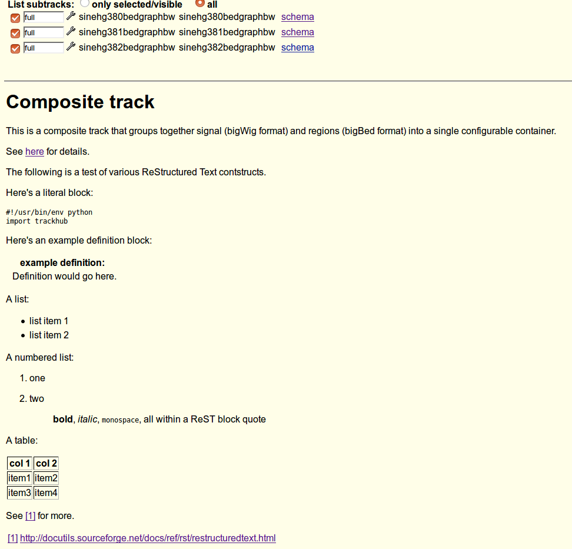

.. _htmldoc-example:

Documenting tracks in hubs
==========================
`trackhub` supports documentation written in `ReStructured Text
<http://docutils.sourceforge.net/docs/ref/rst/restructuredtext.html>`_ that is
automatically converted to HTML. Here we show examples of how this works.

* `load the HTML doc example on UCSC <http://genome.ucsc.edu/cgi-bin/hgTracks?db=hg38&hubUrl=https://raw.githubusercontent.com/daler/trackhub-demo/master/example_htmldoc_hub/htmldoc.hub.txt&position=chr1%3A1-5000>`_
* `files in GitHub <https://github.com/daler/trackhub-demo/tree/master/example_htmldoc_hub>`_

The composite track's documentation as created below will look like this in the
Genome Browser:

The UCSC Genome Browser shows the HTML documentation **only** for the top-level
track-like object and ignores lower-level documentation. For example, if you
have documentation for a track, and add it directly to the TrackDb, the track
documentation will be displayed in the Genome Browser. However if you add the
track to a ViewTrack (which is in turn added to a CompositeTrack, which is in
turn added to the TrackDb), then the top-level track-like object is the
CompositeTrack, so only the CompositeTrack's documentation will be displayed
and will override any ViewTrack or Track documentation.

Similarly, adding a track to a SuperTrack will show the SuperTrack's
documentation for the track rather than the track's documentation. The example
below demonstrates both situations.

This example is somewhat of an extension of :ref:`grouping-example`, so you may
want to look at that first.

.. code-block:: python

    import glob, os
    from textwrap import dedent
    import trackhub

    # Initialize the components of a track hub, already connected together
    hub, genomes_file, genome, trackdb = trackhub.default_hub(
        hub_name="htmldoc",
        short_label='example htmldoc hub',
        long_label='example htmldoc hub',
        genome="hg38",
        email="dalerr@niddk.nih.gov")

    # Create a composite track. The documentation we add here will also be used
    # for all child tracks that are added to the child ViewTracks.
    composite = trackhub.CompositeTrack(
        name='composite',
        short_label='Signal and regions',
        tracktype='bigWig',
        visibility='full',
        html_string=dedent(
        """
        Composite track
        ---------------

        This is a composite track that groups together signal (bigWig format)
        and regions (bigBed format) into a single configurable container.

        See `here <https://genome.ucsc.edu/goldenPath/help/trackDb/trackDbHub.html#compositeTrack>`_
        for details.

        The following is a test of various ReStructured Text contstructs.

        Here's a literal block::

            #!/usr/bin/env python
            import trackhub

        Here's an example definition block:

        :example definition:
            Definition would go here.

        A list:

        - list item 1
        - list item 2

        A numbered list:

        #. one
        #. two

            **bold**, *italic*, ``monospace``, all within a ReST block quote

        A table:

        ======== ========
          col 1   col 2
        ======== ========
          item1   item2
          item3   item4
        ======== ========

        See [1]_ for more.

        .. [1] http://docutils.sourceforge.net/docs/ref/rst/restructuredtext.html
        """),
    )

    # Add the composite track to the trackDb
    trackdb.add_tracks(composite)

    # A ViewTrack for signal.
    signal_view = trackhub.ViewTrack(
        name='signalviewtrack',
        view='signal',
        visibility='full',
        tracktype='bigWig',
        short_label='Signal',
        html_string=dedent(
        '''
        Signal view docs
        ----------------
        While a file for this HTML documentation is created and uploaded, it
        will be overridden by the CompositeView's documentation.
        '''
        )
    )
    composite.add_view(signal_view)

    # This multiWig overlay track will shows multiple bigWigs overlaying each
    # other in the same track
    overlay = trackhub.AggregateTrack(
        aggregate='transparentOverlay',
        visibility='full',
        tracktype='bigWig',
        viewLimits='-2:2',
        maxHeightPixels='8:80:128',
        showSubtrackColorOnUi='on',
        name='agg',
        html_string=dedent(
        '''
        Overlay
        -------
        This is a transparent overlay aggregate track. Over in the `grouping
        example hub <https://daler.github.io/trackhub/grouping.html>`_, we had
        added the overlay track to a SuperTrack. In that case, the SuperTrack's
        documentation would override this documentation.

        However, in this example, we are adding the overlay track directly to
        the TrackDb and so this documentation will be displayed.
        '''),
    )

    trackdb.add_tracks(overlay)

    # As in the README example, we grab all the example bigwigs
    for bigwig in glob.glob(os.path.join(trackhub.helpers.data_dir(), "*hg38*.bw")):
        track = trackhub.Track(
            name=trackhub.helpers.sanitize(os.path.basename(bigwig)),
            source=bigwig,
            visibility='full',
            tracktype='bigWig',
            viewLimits='-2:2',
            maxHeightPixels='8:50:128',
            html_string=dedent(
            '''
            Track as part of composite
            --------------------------
            While the HTML file is uploaded for this track, UCSC currently
            displays the composite track's HTML instead.

            This track was from {}'''
            .format(os.path.basename(bigwig))
            ),
        )
        signal_view.add_tracks(track)

        # For the multiWig overlay track, we need to add the track there as
        # well. However it needs a different name. We have all the pieces,
        # might as well just make another track object:
        track2 = trackhub.Track(
            name=trackhub.helpers.sanitize(os.path.basename(bigwig)) + 'agg',
            source=bigwig,
            visibility='full',
            tracktype='bigWig',
        )
        overlay.add_subtrack(track2)

    # This is a single bigBed track we are adding directly to the TrackDb. This
    # track's documentation will be displayed.
    bigbed = glob.glob(os.path.join(trackhub.helpers.data_dir(), '*hg38*.bigBed'))[0]
    single_track = trackhub.Track(
        name=trackhub.helpers.sanitize(os.path.basename(bigbed)) + '1',
        source=bigbed,
        visibility='dense',
        tracktype='bigBed',
        html_string=dedent(
        '''
        Track docs
        ----------
        Documentation for a single track. Since this track is added directly to
        the trackdb, and not to a view or composite, its specific documentation
        is retained.
        ''')
    )
    trackdb.add_tracks(single_track)

    trackhub.upload.upload_hub(hub=hub, host='localhost', remote_dir='example_hubs/example_htmldoc_hub')

    if 0:
        trackhub.upload.upload_hub(
            hub=hub, host='example.com', user='username',
            remote_dir='/var/www/example_hub')
